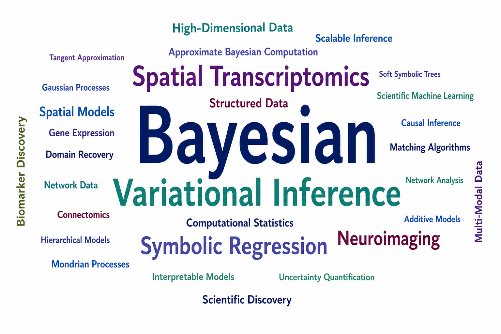

<!-- 
My research develops statistical methods for **high-dimensional and structured data**, with a focus on scalable inference, interpretability, and scientific applications.

{.research-wordcloud1}

--- -->

::: {.columns .research-intro}

::: {.column width="60%" .research-text}

My research develops statistical methods for **high-dimensional and structured data**, with an emphasis on scalable inference, interpretability, and uncertainty quantification. I am particularly interested in problems where complex structure arises naturally—such as spatial, network, and multi-modal data—and in designing computationally efficient models that remain scientifically meaningful.

:::

::: {.column width="40%"}

{.research-wordcloud}

:::
:::

---

## Spatial Transcriptomics {#spatial-transcriptomics}

Spatial transcriptomics integrates gene expression with spatial information to study tissue organization and heterogeneity. My work focuses on Bayesian models for joint inference of spatial structure and gene-level variation.

- **JASPER: Joint Bayesian Analysis of Spatial Expression via Regression**  
  **Dey, P.**, Guhaniyogi, R., Ni, Y., Mallick, B.K.  
  [arXiv preprint](https://arxiv.org/abs/2604.18742). Submitted. [Code](https://github.com/pritamdey/pyJASPER).

- **Joint Integrative Spatial Transcriptomics via Bayesian Modeling for Domain Recovery and Spatially Variable Gene Selection**  
  **Dey, P.**, Guhaniyogi, R., Ni, Y., Mallick, B.K.  
  In preparation.

---

## Variational Inference {#variational-inference}

I develop scalable approximate Bayesian inference methods for complex likelihoods. A central theme is **tangent approximation**, a computationally efficient alternative to classical variational methods with strong theoretical grounding.

- **A Generalized Tangent Approximation Framework for Strongly Super-Gaussian Likelihoods**  
  Roy, S., **Dey, P.**, Pati, D., Mallick, B.K.  
  [arXiv preprint](https://doi.org/10.48550/arXiv.2504.05431). Major revision, JASA (Theory and Methods).  [Code](https://github.com/Roy-SR-007/TAVIE-SSG).

---

## Symbolic Regression {#symbolic-regression}

Symbolic regression aims to discover interpretable mathematical expressions directly from data. My work focuses on Bayesian and variational approaches for structured, uncertainty-aware symbolic learning.

- **VaSST: Variational Inference for Symbolic Regression using Soft Symbolic Trees**  
  Roy, S., **Dey, P.**, Mallick, B.K.  
  [arXiv preprint](https://doi.org/10.48550/arXiv.2602.23561). Accepted at Uncertainty in Artificial Intelligence (UAI) 2026. [Code](https://github.com/ProbabilisticSR/VaSST).

- **Probabilistic Symbolic Regression for Equation Discovery via Operator-induced and Regularized Symbolic Forests**  
  Roy, S., **Dey, P.**, Pati, D., Mallick, B.K.  
  [arXiv preprint](https://doi.org/10.48550/arXiv.2509.19710). Submitted. [Code](https://github.com/ProbabilisticSR/BayeSymX).
  

---

## Multi-Omic Integration {#multi-omic}

My work in bioinformatics focuses on integrating multiple omics modalities for biomarker discovery and mechanistic understanding. Key themes include representation learning, modality prioritization, and mediation analysis.

- **Noninvasive fecal multi-omic signatures for Apc^S580/+^/Kras^G12D/+^ mice**  
  Ivanov, I., Mullens, D., **Dey, P.**, Chung, H.C., Gaynanova, I., Ni, Y., Ufondu, A., Yang, F., Han, H., Woods, P., Goldsby, J.S., Davidson, L.A., Safe, S.H., Jayaraman, A., Chapkin, R.S.  
  In preparation.

- **Diet shapes gut microbial function and indirectly influences host gene expression in infants**  
  **Dey, P.**, Mullens, D., Ivanov, I., Chapkin, R., Donovan, S., et al.  
  In preparation.

---

## Neuroimaging {#neuroimaging}

Neuroimaging data involves high dimensionality, multi-resolution structure, and complex interactions across modalities. My work develops scalable models for joint analysis of network and spatial imaging data.

- **Additive Nonparametric Regression with Spatial and Network Objects**  
  Guhaniyogi, R., **Dey, P.**, Chandra, K., Scheffler, A., Mallick, B.K.  
  Major revision, Biometrics. [Code](https://github.com/pritamdey/AMOGP).

- **Outlier detection for multi-network data**  
  **Dey, P.**, Zhang, Z., Dunson, D.B.  
  *Bioinformatics*, 2022. [DOI](https://doi.org/10.1093/bioinformatics/btac431). [Code](https://github.com/pritamdey/ODIN-python).

- **Ensembles of Mondrian Processes for Continuous Modeling of Structural Connectomes**  
  **Dey, P.**, Zhang, Z., Dunson, D.B.  
  In preparation.

- **Hierarchical Ensembles of Mondrian Processes for Simultaneous Modeling of Common and Individual Structure of Connectome Data**  
  **Dey, P.**, Zhang, Z., Dunson, D.B.  
  In preparation.

---

## Machine Learning for Causal Inference {#causal-inference}

I have worked on scalable matching-based methods for causal inference, with emphasis on interpretability and computational efficiency in large datasets.

- **dame-flame: a Python package providing fast interpretable matching for causal inference**  
  Gupta, N.R., Orlandi, V., Chang, C.-R., Wang, T., Morucci, M., **Dey, P.**, Howell, T.J., Sun, X., Ghosal, A., Roy, S., Rudin, C., Volfovsky, A.  
  *Journal of Statistical Software*, 2025. [DOI](https://doi.org/10.18637/jss.v113.i02). [Code](https://pypi.org/project/dame-flame/).

---

[View all Publications at a glance →](publications.qmd){.btn .btn-primary}

